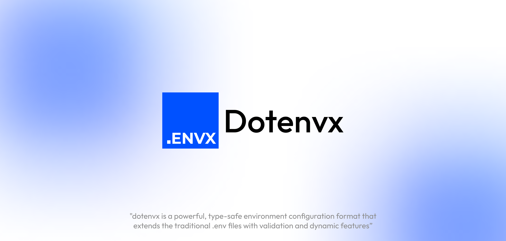

# Dotenvx



**Dotenvx** is a modern and type-safe alternative to traditional `.env` files. It brings validation, type inference, schema support, and a minimal CLI — all in a single developer-friendly solution.

## Why dotenvx?

Traditional `.env` files lack structure and safety:

- ❌ No type validation (everything is a string)
- ❌ No way to define required or optional values
- ❌ No default values or enums
- ❌ No documentation inside `.env` itself

**dotenvx solves this** by allowing both configuration and schema to live in the same file (`.envx`), with first-class support for validation, multiline values, conditional logic, and more.

---

## Features

- ✅ Schema support with types, defaults, and requirements
- ✅ Validation on load, with meaningful errors
- ✅ Smart variable interpolation & ternary expressions
- ✅ Triple-quoted multiline values
- ✅ Built-in CLI (`dotenvx`) for automation and CI/CD use
- ✅ Type-safe runtime access via `getEnvx()`
- ✅ Compatible with `process.env` usage

---

## Installation

```bash
pnpm add dotenvxjs
# or
npm install dotenvxjs
```

---

## Programmatic Usage

```ts
import { loadEnvx, getEnvx } from "dotenvxjs";

// Loads and validates the .envx file (default is "./.envx")
loadEnvx();

const env = getEnvx();

console.log(env.PORT);        // typed access, number
console.log(env.API_URL);     // resolved with ternary + interpolation
console.log(env.NODE_ENV);    // enum value
```

Once loaded, all validated values are also available in `process.env`.

---

## Example .envx File

```env
DEV_MODE=false

API_URL=${DEV_MODE} ? "http://localhost:3000" : "https://api.example.com"
API_TOKEN=${DEV_MODE} ? "dev-token" : "prod-token"
FULL_API_URL="${API_URL}?token=${API_TOKEN}&env=${NODE_ENV}"

PORT=8080
DATABASE_NAME="my_db"

WELCOME_TEXT="""
Welcome to the new config system.
This supports multi-line values easily.
"""

# schema definition starts here
[DEV_MODE]
type="boolean"

[PORT]
type="number"
required=true

[API_URL]
type="string"

[NODE_ENV]
type="enum"
values=["production", "development", "test"]
default="development"
required=true

[DATABASE_NAME]
type="string"
required=true

[WEBSITE_URL]
type="url"
required=true
deprecated=true
```

---

## CLI Usage

The `dotenvx` CLI is installed automatically with the package.

### `npx dotenvx build`

Generates a `.env` file from your `.envx`:

```bash
npx dotenvx build
```

#### Options:

| Option | Description | Default |
|--------|-------------|---------|
| `-i, --input` | Input `.envx` file | `.envx` |
| `-o, --output` | Output `.env` file | `.env` |
| `--overwrite` | Overwrite if exists | `false` |

---

### `npx dotenvx check`

Validates `.envx` against its declared schema:

```bash
npx dotenvx check
```

---

### `npx dotenvx print`

Prints the parsed and interpolated `.envx` as JSON:

```bash
npx dotenvx print
```

---

### `npx dotenvx types`

Generates a `.ts` file with full TypeScript typings based on the schema:

```bash
npx dotenvx types
```

#### Options:

| Option | Description | Default |
|--------|-------------|---------|
| `-o, --output` | Output `.ts` file | `envx.ts` |

---

## Configuration File

You can create an optional `envx.config.js` in your project root to provide defaults for CLI options.

```js
// envx.config.js
export default {
  input: ".envx",
  output: {
    env: ".env",
    types: "src/envx.ts",
  },
  overwrite: true,
};
```

---

## Type Definitions

If you want to use `envx` with TypeScript safely in your project:

```ts
// Load config
loadEnvx();

// Use with TS autocompletion
const env = getEnvx();
```

If you're using `npx dotenvx types`, it will auto-generate typings you can import:

```ts
import { Env } from "./envx.ts";

const env: Env = getEnvx();
```


## Editor Integration

dotenvx is fully compatible with the official VSCode extension for `.envx` files, which provides:

- Syntax highlighting
- Auto-completion
- Inline validation errors and warnings
- Hover tooltips for schema metadata such as `description` and `deprecated`

> Note: Fields like `description` and `deprecated` are **only used by the VSCode extension for developer experience** and do not affect runtime behavior or validation.
---

## File Structure Suggestion


## Roadmap

- [x] Ternary & interpolation support
- [x] CLI interface
- [x] Type-safe runtime API
- [x] Enum & default handling
- [x] VSCode syntax plugin
- [ ] Web playground for `.envx` files
- [ ] Linting rules and formatting

---

## License

MIT © Trymagic
